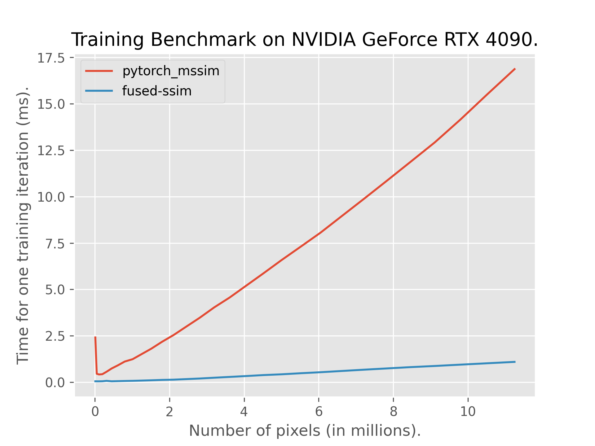
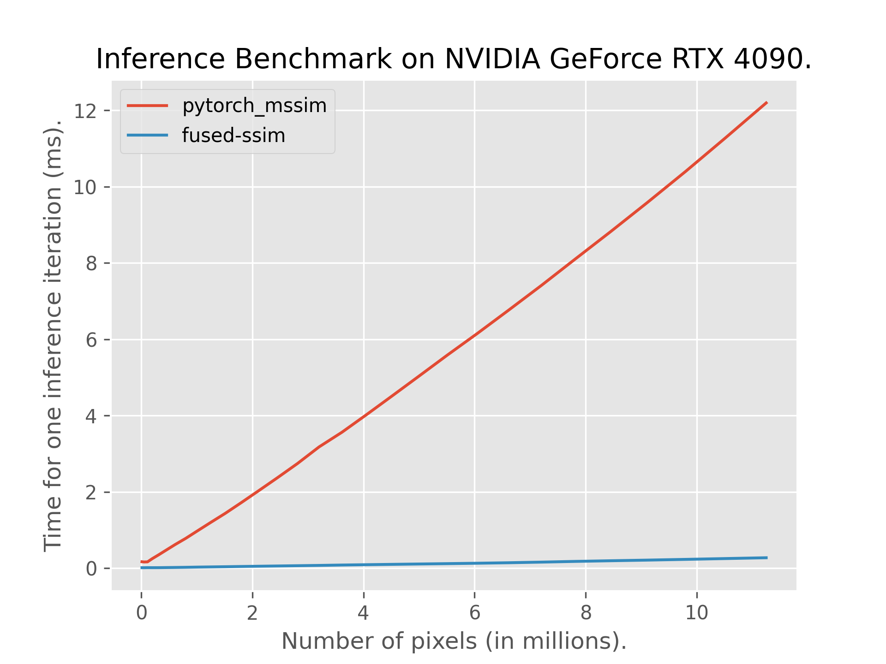
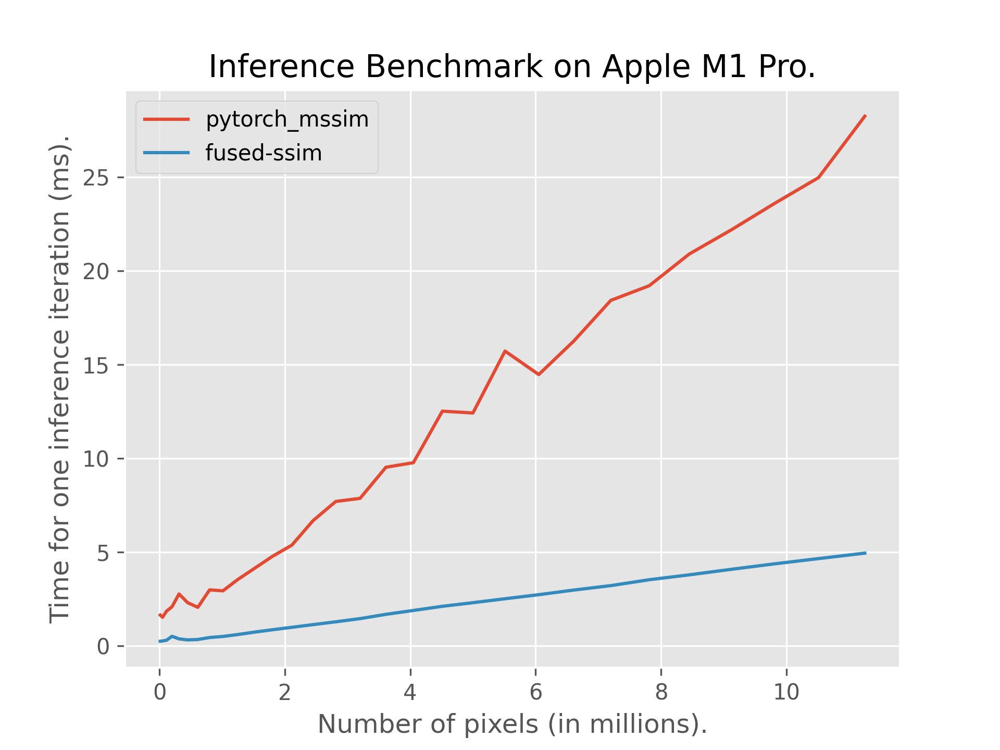

# Fully Fused Differentiable SSIM

This repository contains an efficient fully-fused implementation of [SSIM](https://en.wikipedia.org/wiki/Structural_similarity_index_measure) which is differentiable in nature. There are several factors that contribute to an efficient implementation:
- Convolutions in SSIM are spatially localized leading to fully-fused implementation without touching global memory for intermediate steps.
- Backpropagation through Gaussian Convolution is simply another Gaussian Convolution itself.
- Gaussian Convolutions are separable leading to reduced computation.
- Gaussians are symmetric in nature leading to fewer computations.
- Single convolution pass for multiple statistics.

As per the original SSIM paper, this implementation uses `11x11` sized convolution kernel. The weights for it have been hardcoded and this is another reason for it's speed. This implementation currently only supports **2D images** but with **variable number of channels** and **batch size**.

## Hardware Compatibility

Thanks to the [contributors](#acknowledgements), this implementation supports the following GPU architectures:

- **NVIDIA GPUs** (CUDA).
- **AMD GPUs** (ROCm).
- **Apple Silicon** (Metal Performance Shaders).
- **Intel GPUs** (SYCL).

## Software Compatibility

This project has been tested with:

### NVIDIA CUDA
- PyTorch `2.3.1+cu118` and CUDA `11.8` on Ubuntu 24.04 LTS
- PyTorch `2.4.1+cu124` and CUDA `12.4` on Ubuntu 24.04 LTS
- PyTorch `2.5.1+cu124` and CUDA `12.6` on Windows 11

### Apple Metal (macOS)
- PyTorch `2.5.1` on macOS 15.7.1

## Installation Instructions

### Prerequisites

You must have PyTorch installed with the appropriate backend for your GPU before installing fused-ssim. The installation process requires the backend compilers to be available.

### Step 1: Install PyTorch with Correct Backend

Choose the installation method based on your GPU:

#### NVIDIA CUDA

First, ensure you have CUDA Toolkit installed on your system (version 11.8 or 12.x recommended).

```bash
# For CUDA 12.4
pip install torch torchvision --index-url https://download.pytorch.org/whl/cu124
```

Verify NVCC (CUDA compiler) is available:
```bash
nvcc --version
```

#### AMD ROCm

First, ensure you have ROCm installed on your system (version 5.7 or newer recommended).

```bash
# For ROCm 6.1
pip install torch torchvision --index-url https://download.pytorch.org/whl/rocm6.1
```

Verify HIP compiler is available:
```bash
hipcc --version
```

#### Apple Metal (MPS)

Install PyTorch 2.5.1 with MPS backend.

```bash
pip install torch torchvision
```

#### Intel SYCL

First, ensure you have Intel oneAPI Base Toolkit installed with DPC++/SYCL compiler support.

```bash
# Install PyTorch for Intel XPU
pip install torch torchvision --index-url https://download.pytorch.org/whl/xpu
```

Verify Intel SYCL compiler is available:
```bash
icpx --version
```

<details>
<summary>Additional Intel XPU Build Instructions</summary>

**Important:** The OneAPI version must match the version used by your PyTorch XPU installation (e.g., both should be 2025.0.*).

**Linux Build:**

Setup the OneAPI environment:
```bash
source /opt/intel/oneapi/setvars.sh
```

Install fused-ssim:
```bash
git clone https://github.com/rahul-goel/fused-ssim.git
cd fused-ssim
pip install --no-build-isolation .
```

To build a distributable wheel:
```bash
python -m build --no-isolation --wheel
```

**Windows Build:**

Setup the environment with MSBuild tools and OneAPI:
```bash
cmd /k "C:\Program Files (x86)\Microsoft Visual Studio\2022\BuildTools\VC\Auxiliary\Build\vcvars64.bat"
powershell
cmd /k "C:\Program Files (x86)\Intel\oneAPI\setvars.bat"
powershell
```

Then follow the Linux build instructions above.

**Note:** The `--no-build-isolation` flag is necessary for fused-ssim to find and link to PyTorch libraries.
</details>

### Step 2: Install Fused-SSIM

Once PyTorch and the appropriate backend compiler are installed:

```bash
# Install from GitHub (recommended)
pip install git+https://github.com/rahul-goel/fused-ssim/ --no-build-isolation

# Or clone and install locally
git clone https://github.com/rahul-goel/fused-ssim.git
cd fused-ssim
pip install . --no-build-isolation
```

The setup.py script will automatically detect your GPU architecture. For verbose output:

```bash
pip install git+https://github.com/rahul-goel/fused-ssim/ -v --no-build-isolation
```

If the above commands don't work, try:

```bash
python setup.py install
```

If you want to specify the GPU architecture manually, like for example to compile a docker image that will run in a different host, you can do so by setting the `CUDA_ARCHITECTURES` environment variable. For example, to set it to `8.9 and 12.0`, run `CUDA_ARCHITECTURES="89;120" pip install git+https://github.com/rahul-goel/fused-ssim/`.

### Troubleshooting

- **CUDA errors**: Ensure your CUDA Toolkit version matches your PyTorch CUDA version
- **ROCm errors**: Verify ROCm installation with `rocm-smi` and check PyTorch ROCm compatibility
- **Metal errors**: Ensure Xcode Command Line Tools are installed and up to date
- **Intel errors**: Source the Intel oneAPI environment before installation: `source /opt/intel/oneapi/setvars.sh`
## PyTorch Installation Instructions
- You must have CUDA and PyTorch+CUDA installed in you Python 3.X environment. This project has currently been tested with:
  - PyTorch `2.3.1+cu118` and CUDA `11.8` on Ubuntu 24.04 LTS.
  - PyTorch `2.4.1+cu124` and CUDA `12.4` on Ubuntu 24.04 LTS.
  - PyTorch `2.5.1+cu124` and CUDA `12.6` on Windows 11.
- Run `pip install git+https://github.com/rahul-goel/fused-ssim/ --no-build-isolation` or clone the repository and run `pip install . --no-build-isolation` from the root of this project.
- setup.py should detect your GPU architecture automatically. If you want to see the output, run `pip install git+https://github.com/rahul-goel/fused-ssim/ -v --no-build-isolation` or clone the repository and run `pip install . -v --no-build-isolation` from the root of this project.
- If you want to specify the GPU architecture manually, like for example to compile a docker image that will run in a different host, you can do so by setting the `CUDA_ARCHITECTURES` environment variable. For example, to set it to `8.9 and 12.0`, run `CUDA_ARCHITECTURES="89;120" pip install git+https://github.com/rahul-goel/fused-ssim/`.
- If the previous command does not work, run `python setup.py install` from the root of this project.

## Usage
```python
import torch
from fused_ssim import fused_ssim

# predicted_image, gt_image: [BS, CH, H, W]
# predicted_image is differentiable
gt_image = torch.rand(2, 3, 1080, 1920)
predicted_image = torch.nn.Parameter(torch.rand_like(gt_image))
ssim_value = fused_ssim(predicted_image, gt_image)
```

By default, `same` padding is used. To use `valid` padding which is the kind of padding used by [pytorch-mssim](https://github.com/VainF/pytorch-msssim):
```python
ssim_value = fused_ssim(predicted_image, gt_image, padding="valid")
```

If you don't want to train and use this only for inference, use the following for even faster speed:
```python
with torch.no_grad():
  ssim_value = fused_ssim(predicted_image, gt_image, train=False)
```

## Constraints
- Currently, only one of the images is allowed to be differentiable i.e. only the first image can be `nn.Parameter`.
- Limited to 2D images.
- Images must be normalized to range `[0, 1]`.
- Standard `11x11` convolutions supported.

## Performance
This implementation is 5-8x faster than the previous fastest (to the best of my knowledge) differentiable SSIM implementation [pytorch-msssim](https://github.com/VainF/pytorch-msssim).

  

## BibTeX
If you leverage fused SSIM for your research work, please cite our main paper:
```
@inproceedings{taming3dgs,
    author = {Mallick, Saswat Subhajyoti and Goel, Rahul and Kerbl, Bernhard and Steinberger, Markus and Carrasco, Francisco Vicente and De La Torre, Fernando},
    title = {Taming 3DGS: High-Quality Radiance Fields with Limited Resources},
    year = {2024},
    url = {https://doi.org/10.1145/3680528.3687694},
    doi = {10.1145/3680528.3687694},
    booktitle = {SIGGRAPH Asia 2024 Conference Papers},
    series = {SA '24}
}
```

## Acknowledgements
Thanks to:
- [Bernhard](https://snosixtyboo.github.io) for the idea.
- [asrathore-ai](https://github.com/asrathore-ai) for adding SYCL kernels.
- [Anton Smirnov](https://pxl-th.github.io/) for adding AMD GPU enablement.
- [Jonah J. Newton](https://jonahnewton.com.au/) for Apple MPS kernels.
- [Janusch](https://github.com/MrNeRF) for further CUDA optimizations.
- [Florian](https://fhahlbohm.github.io/) and [Ishaan](https://ishaanshah.xyz) for testing.
