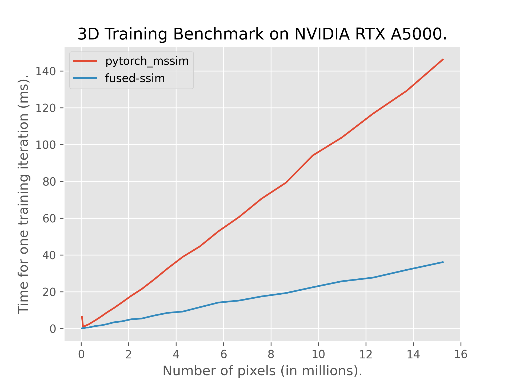
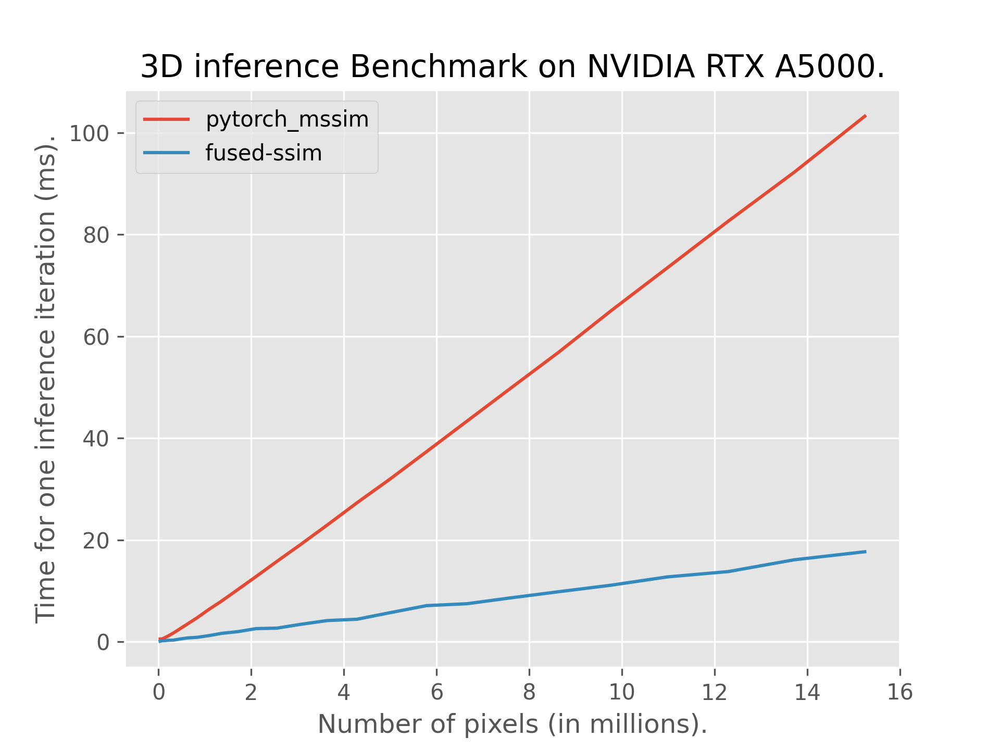

# 3D Fully Fused Differentiable SSIM

This repository contains an adaptation of [fused-ssim](https://github.com/rahul-goel/fused-ssim) for PyTorch that also supports 3D images. It is up to 8x faster in 2D and roughly 5x faster in 3D compared to the previous fastest implementation - [pytorch-msssim](https://github.com/VainF/pytorch-msssim). 

The 3D implementation (```fused_ssim3d```) retains the same assumptions as 2D, following the original SSIM paper and (wherever possible) translating the 2D optimizations to 3D. It is also possible to call the original 2D instance of fused-ssim (now under ```fused_ssim2d```).

Check out the original [fused-ssim](https://github.com/rahul-goel/fused-ssim) repository for further background and details why this approach is faster. 

## Hardware Compatibility

Only NVIDIA GPUs are supported. The support for the other hardware was not carried over from 2D fused-ssim as of now.

- **NVIDIA GPUs** (CUDA).

- ~~**AMD GPUs** (ROCm).~~ ~~**Apple Silicon** (Metal Performance Shaders).~~
 ~~**Intel GPUs** (SYCL).~~

## Installation Instructions

### Prerequisites

You must have PyTorch installed with the appropriate backend for your GPU before installing fused-ssim. The installation process requires the backend compilers to be available.

### Step 1: Install PyTorch with CUDA

First, ensure you have CUDA Toolkit installed on your system (version 11.8 or 12.x recommended).

```bash
# For CUDA 12.4
pip install torch torchvision --index-url https://download.pytorch.org/whl/cu124
```

Verify NVCC (CUDA compiler) is available:
```bash
nvcc --version
```


### Step 2: Install Fused-SSIM3D

Once PyTorch and the appropriate backend compiler are installed:

```bash
# Install from GitHub (recommended)
pip install git+https://github.com/PaPieta/fused-ssim3D --no-build-isolation

# Or clone and install locally
git clone https://github.com/PaPieta/fused-ssim3D
cd fused-ssim3D
pip install . --no-build-isolation
```

The setup.py script will automatically detect your GPU architecture. For verbose output:

```bash
pip install git+https://github.com/rahul-goel/fused-ssim/ -v --no-build-isolation
```

If the above commands don't work, try:

```bash
python setup.py install
```

### Troubleshooting

- **CUDA errors**: Ensure your CUDA Toolkit version matches your PyTorch CUDA version

## Usage

### 3D
```python
import torch
from fused_ssim3d import fused_ssim3d

# predicted_image, gt_image: [BS, CH, D, H, W]
# predicted_image is differentiable
gt_image = torch.rand(2, 3, 96, 96, 96)
predicted_image = torch.nn.Parameter(torch.rand_like(gt_image))
ssim_value = fused_ssim3d(predicted_image, gt_image)
```

### 2D (legacy)
```python
import torch
from fused_ssim3d import fused_ssim2d

# predicted_image, gt_image: [BS, CH, H, W]
# predicted_image is differentiable
gt_image = torch.rand(2, 3, 1080, 1920)
predicted_image = torch.nn.Parameter(torch.rand_like(gt_image))
ssim_value = fused_ssim2d(predicted_image, gt_image)
```

By default, `same` padding is used. To use `valid` padding which is the kind of padding used by [pytorch-mssim](https://github.com/VainF/pytorch-msssim):
```python
ssim_value = fused_ssim3d(predicted_image, gt_image, padding="valid")
```

If you don't want to train and use this only for inference, use the following for even faster speed:
```python
with torch.no_grad():
  ssim_value = fused_ssim3d(predicted_image, gt_image, train=False)
```

## Constraints

### 3D-specific
- Due to the significantly increased number of operations (3 sets of 1D convolutions vs 2), and subsequent numerical errors, Fused-SSIM3D does not align with pytorch-msssim as well as Fused-SSIM (2D) did. Still, it returns SSIM scores that agree roughly up to 1e-5.

### Legacy
- Currently, only one of the images is allowed to be differentiable i.e. only the first image can be `nn.Parameter`.
- Images must be normalized to range `[0, 1]`.
- Standard `11x11` convolutions supported.

## Performance
The performance of the 2D version is retained (see [here](https://github.com/rahul-goel/fused-ssim/tree/main?tab=readme-ov-file#performance)). In 3D, reaching the same acceleration is constrained by the shared memory size, here 48KB. Still, Fused-SSIM3D is approximately 5x faster than [pytorch-msssim](https://github.com/VainF/pytorch-msssim).

  

## BibTeX
If you use this 3D fused SSIM implementation your research work, please cite both the original paper and this repository:
```
@misc{fusedssim3d2025,
    title        = {{3D} Fully Fused Differentiable {SSIM}},
    author       = {Pawel Tomasz Pieta},
    year         = 2025,
    journal      = {GitHub repository},
    publisher    = {GitHub},
    howpublished = {\url{https://github.com/PaPieta/fused-ssim3D}}
}
@inproceedings{taming3dgs,
    author = {Mallick, Saswat Subhajyoti and Goel, Rahul and Kerbl, Bernhard and Steinberger, Markus and Carrasco, Francisco Vicente and De La Torre, Fernando},
    title = {Taming 3DGS: High-Quality Radiance Fields with Limited Resources},
    year = {2024},
    url = {https://doi.org/10.1145/3680528.3687694},
    doi = {10.1145/3680528.3687694},
    booktitle = {SIGGRAPH Asia 2024 Conference Papers},
    series = {SA '24}
}
```
